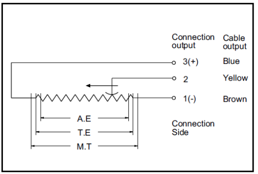
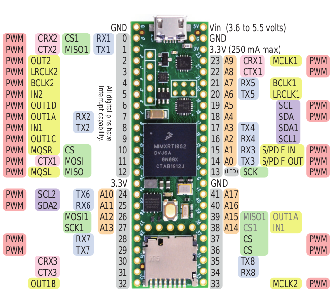
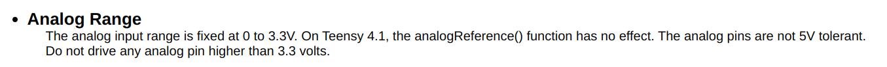
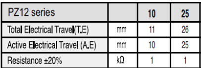
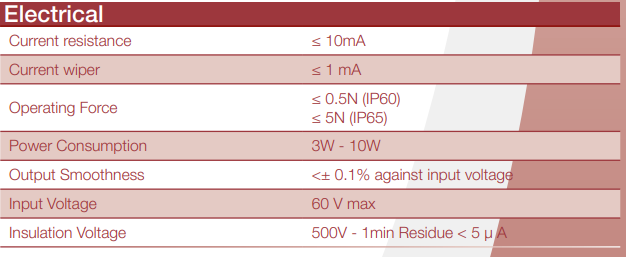
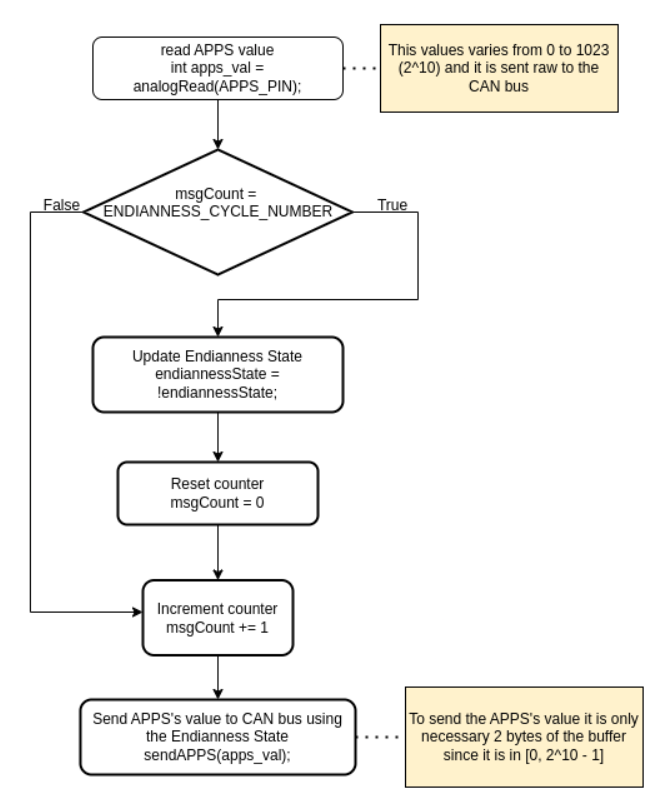
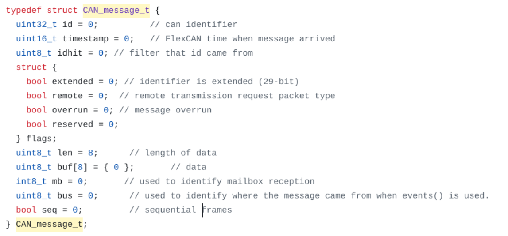
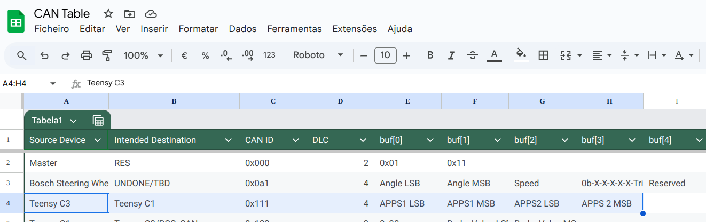

# Reading from APPS and sensing it thought the CAN Bus Line

## Circuit Schematics
The APPS works like a potentiometer, as you can see in the image  

  

When powering the APPS and connecting in to an analog pin in the Teensy, you are able to read the voltage coming from it with which you can then know how much the pedal has traveled since the voltage and the distance have a linear relation between them. That data is then sent to the CAN Bus (following the respective ID, length and buffer data), by using a CAN Transceiver. Since we are powering all of this with a 24 volt battery, we will be using a DC/DC converter to step down the voltage to 5v, so it is able to power the Teensy (since this microcontroller has to be powered with voltage varying from 3.6v to 6v. We decided to go with 5v since it is a value already used in the car). 
  

Moreover, since the analog pin in the Teensy only supports voltage of up to 3.3v and since it is possible to power the APPS with that same voltage (max 60v), we will be using the 3.3v pin in the Teensy to power the APPS (since it does not use more then 250 mA which is the max current that you can drawn from one pin, because it has a resistance of 1k ohms +/- 20%). 
  
  

Here's an image of the schematics and its link.  
Link:  
IMG

## Code
Here's am image of the schematics that we used for the change in the endianness of the message, that also contains some details of our implementation.  
<a href="https://drive.google.com/file/d/1KbxM-VLz5GqEzZXmRr_Mq3aF3P88dXgd/view?usp=drive_link">Link</a>  

Our code is in the *apps.cpp* file. It makes use of the Arduino library (which contains functions like *analogRead()* and *pinMode()*) and the *FlexCAN_T4.h*. This one is used for the communication via the CAN protocol.

To send a CAN message using this library, we have to create a variable using the struct *CAN_message_t*. Here, we define, among other things, the ID, the data and its length in bytes.  
 
The ID of the message you can find in the *CAN Table* file in the FS Google Drive.  
 

